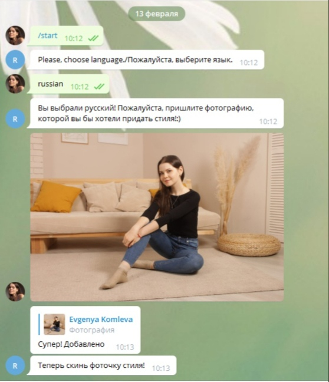
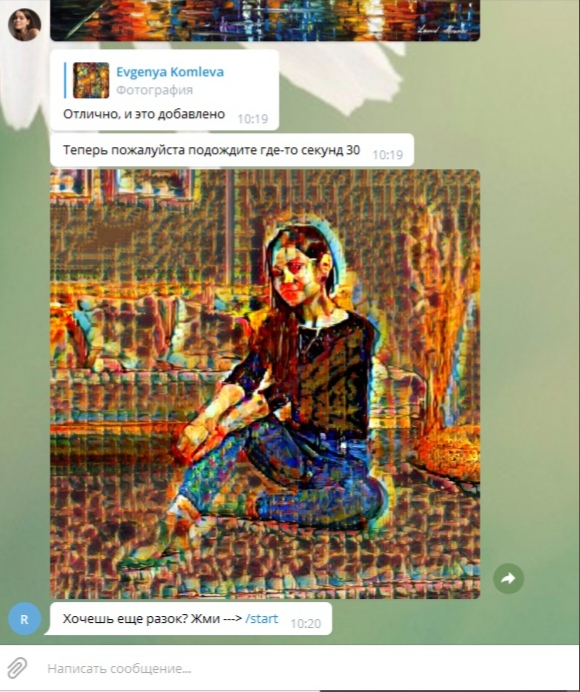

# StyleTransferBot

## Install

0. `git clone https://github.com/EvgeniaKomleva/StyleTransferBot.git`

1. `pip install -r requirements.txt`

2. Создайте бота  в телеграмм-боте `@BotFather`, копируйте токен в 13 строку `bot = telebot.TeleBot('ВАШ ТОКЕН');`
 
3. `python bot1.py`

[Заметка об архитектуре бота](https://github.com/EvgeniaKomleva/StyleTransferBot/blob/main/NeuralStyleTransfer.pdf)

